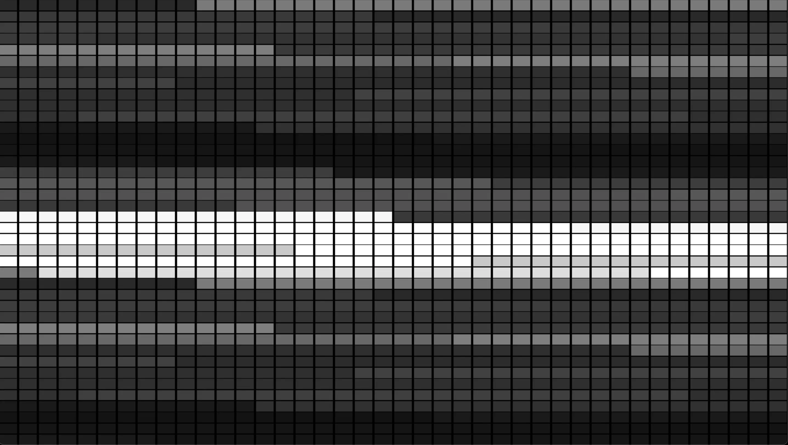

# Bitcoin Data Visualization

A simple WebGL visualization of Bitcoin price data from 2018 to 2021.



## About

This project uses Three.js and custom GLSL shaders to create a visual representation of historical Bitcoin data.

## Run
```bash
npm install
npm run dev
```

## Tech

- Three.js
- Vite
- GLSL shaders